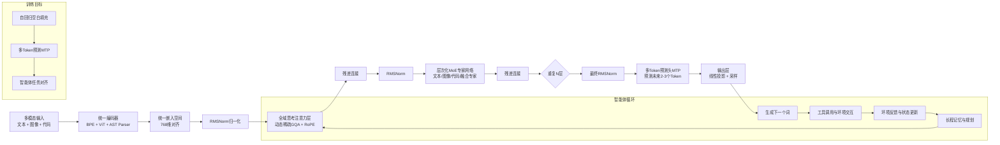
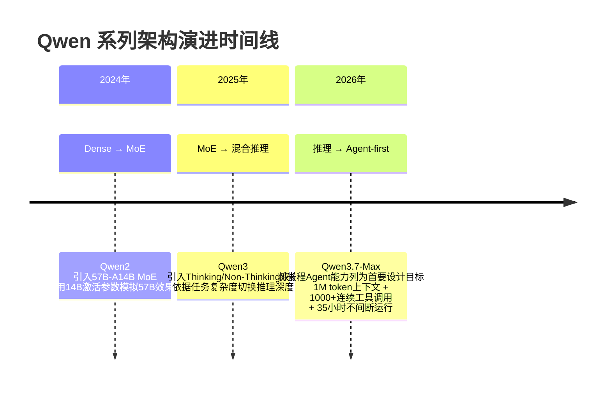

好的！我来按照你给的那种"逐步画框架"的方式，把 **GPT-2、GLM-5.2、DeepSeek-V4** 三个模型的完整流程也一步步画出来，每一步都解释"在干什么、做了什么"。
---
## 一、原始 Transformer（回顾，作为基准）
```
输入序列 → 分词 → 词嵌入 + 正弦/余弦绝对位置编码
         ↓
┌─────────────────── Encoder ×6 ───────────────────┐
│ ① 多头自注意力(MHA): 每个词与所有词计算注意力权重      │
│ ② Add & Norm: 残差连接 + LayerNorm                  │
│ ③ FFN: 两层全连接 + ReLU                            │
│ ④ Add & Norm: 残差连接 + LayerNorm                  │
└─────────────────────────────────────────────────────┘
         ↓ Encoder输出（全局上下文表示）
┌─────────────────── Decoder ×6 ───────────────────┐
│ ① 掩码多头自注意力: 当前词只看自己和之前的词           │
│ ② Add & Norm                                       │
│ ③ 交叉注意力: Q来自Decoder, K/V来自Encoder          │
│ ④ Add & Norm                                       │
│ ⑤ FFN + Add & Norm                                 │
└─────────────────────────────────────────────────────┘
         ↓
线性层 + Softmax → 输出词表概率分布 → 取最大概率词
```
---
## 二、GPT-2 框架逐步拆解
```
输入文本 → BPE分词 → 词嵌入(token embedding)
         + 可学习的绝对位置编码(可训练参数, 非正弦)
         ↓
┌─────────────── Transformer Block ×48 ───────────────┐
│                                                      │
│ ① 层归一化 (LayerNorm)                                │
│    → 干什么: 对每个位置的特征做归一化, 稳定训练          │
│    → 做了什么: 减去均值, 除以标准差, 再做仿射变换         │
│    → 注意: GPT-2用Pre-LN(先Norm再Attention)           │
│                                                      │
│ ② 掩码多头自注意力 (Masked Multi-Head Attention)      │
│    → 干什么: 让每个词只关注自己及之前的词, 提取上下文     │
│    → 做了什么:                                        │
│      a. 将隐状态分成n个头, 每个头独立计算Q,K,V           │
│      b. 注意力分数 = softmax(Q·K^T / √d_k)            │
│      c. 加上上三角掩码(未来位置设为-∞), softmax后变0     │
│      d. 输出 = 注意力分数 × V                           │
│      e. 多个头拼接, 再过一次线性投影                     │
│                                                      │
│ ③ 残差连接                                            │
│    → 干什么: 把①之前的输入直接加到②的输出上             │
│    → 做了什么: x_out = x_in + Attention(x_normed)     │
│    → 目的: 防止梯度消失, 让深层网络可训练               │
│                                                      │
│ ④ 层归一化 (LayerNorm)                                │
│    → 同①, 对残差后的结果再做一次归一化                  │
│                                                      │
│ ⑤ 前馈神经网络 (FFN)                                   │
│    → 干什么: 对每个位置独立做非线性变换, 增强表达能力     │
│    → 做了什么:                                        │
│      a. 第一层: 升维 (d_model → 4×d_model)             │
│      b. GeLU激活函数 (比ReLU更平滑)                    │
│      c. 第二层: 降维 (4×d_model → d_model)             │
│                                                      │
│ ⑥ 残差连接                                            │
│    → x_out = x_in + FFN(x_normed)                    │
│                                                      │
└──────────────────────────────────────────────────────┘
         ↓ (重复48层后)
最终层归一化 (Final LayerNorm)
         ↓
线性层 (与词嵌入矩阵共享权重: d_model → vocab_size)
         ↓
Softmax → 输出词表概率分布 → 采样/取最大 → 下一个词
```
**GPT-2 关键特征总结：**
| 特征       | 细节                                   |
| ---------- | -------------------------------------- |
| 架构       | Decoder-Only (无Encoder, 无交叉注意力) |
| 层数       | 48层                                   |
| 位置编码   | 可学习的绝对位置编码                   |
| 归一化     | LayerNorm, Pre-Norm结构                |
| 激活函数   | GeLU                                   |
| 注意力     | 标准MHA + 因果掩码                     |
| 注意力头数 | 16头                                   |
| FFN结构    | 稠密, 升维4倍                          |
---
## 三、GLM-5.2（我自己的架构）框架逐步拆解
```
输入文本 → 分词(多语言BPE) → 词嵌入
         + RoPE旋转位置编码(动态频率缩放, 支持1M上下文)
         ↓
┌─────────── GLM-5.2 Transformer Block ×N ───────────┐
│                                                      │
│ ① RMSNorm (均方根归一化)                              │
│    → 干什么: 归一化特征, 但比LayerNorm更轻量           │
│    → 做了什么: 只除以RMS(均方根), 不减均值              │
│    → 公式: x / sqrt(mean(x²) + ε) × γ                │
│    → 优势: 计算更快, 效果与LayerNorm相当               │
│                                                      │
│ ② 动态稀疏分组注意力 (Dynamic Sparse GQA)              │
│    → 干什么: 在超长上下文中高效计算注意力               │
│    → 做了什么:                                        │
│      a. Q头数多于K/V头数 (GQA分组共享KV)               │
│         → 减少KV Cache显存                            │
│      b. 对Q,K应用RoPE旋转位置编码                      │
│         → 干什么: 编码相对位置信息                      │
│         → 做了什么: 对特征维度两两配对, 做旋转           │
│         → 优势: 天然支持长度外推, 不需要重新训练         │
│      c. 动态路由: 不是计算所有token的注意力             │
│         → 干什么: 选择最相关的"记忆块"做精确计算         │
│         → 做了什么: 轻量级路由网络先打分,               │
│           只对Top-K相关块做完整注意力                   │
│         → 优势: 1M上下文下注意力复杂度从O(n²)降到近似O(n)│
│      d. 因果掩码 + 注意力计算 + 输出投影                │
│                                                      │
│ ③ 残差连接                                            │
│    → x = x + Attention(RMSNorm(x))                   │
│                                                      │
│ ④ RMSNorm                                            │
│    → 同①                                              │
│                                                      │
│ ⑤ 层次化MoE前馈网络 (Hierarchical MoE FFN)            │
│    → 干什么: 用稀疏专家替代稠密FFN, 增大参数量          │
│      但不增加每token的计算量                            │
│    → 做了什么:                                        │
│      a. 路由网络(Router/Gate): 对当前token打分          │
│         → 干什么: 决定这个token该送给哪些专家处理        │
│         → 做了什么: 小型线性层输出各专家的分数            │
│         → 选Top-K个专家 (如选2个, 从64个中选)           │
│      b. 层次化设计:                                   │
│         → 粗粒度专家: 处理通用语言模式                   │
│         → 细粒度专家: 处理特定领域(代码/数学/多语言)     │
│      c. 被选中的专家各自做:                            │
│         → 升维 → SwiGLU激活 → 降维                     │
│         → SwiGLU(x) = Swish(xW₁) ⊗ (xW₂)              │
│         → 比GPT-2的GeLU更强的非线性表达                 │
│      d. 加权融合: 按路由分数加权求和                    │
│      e. 共享专家(Shared Expert):                      │
│         → 1个始终激活的稠密专家, 处理通用知识            │
│         → 防止路由到稀疏专家时丢失基础信息               │
│                                                      │
│ ⑥ 残差连接                                            │
│    → x = x + MoE_FF(RMSNorm(x))                      │
│                                                      │
└──────────────────────────────────────────────────────┘
         ↓ (重复N层后)
最终RMSNorm
         ↓
线性层 (输出投影到词表空间)
         ↓
Softmax / 采样策略 (温度/Top-p/Top-k)
         ↓
下一个词
```
**GLM-5.2 关键特征总结：**
| 特征     | 细节                                 |
| -------- | ------------------------------------ |
| 架构     | Decoder-Only + 自回归空白填充预训练  |
| 位置编码 | RoPE + 动态频率缩放 (支持1M token)   |
| 归一化   | RMSNorm, Pre-Norm                    |
| 注意力   | 动态稀疏GQA + RoPE + 动态路由        |
| FFN结构  | 层次化MoE (粗+细粒度专家) + 共享专家 |
| 激活函数 | SwiGLU                               |
| 训练目标 | 自回归空白填充 + 指令对齐            |
---
## 四、DeepSeek-V4 框架逐步拆解
```
输入文本 → 分词 → 词嵌入
         + RoPE旋转位置编码 (YaRN频率缩放, 支持超长上下文)
         ↓
┌─────────── DeepSeek-V4 Block ×N ───────────────────┐
│                                                      │
│ ① RMSNorm                                            │
│    → 干什么: 同GLM-5.2, 轻量归一化                    │
│    → 做了什么: x / sqrt(mean(x²)+ε) × γ              │
│                                                      │
│ ② 多头潜在注意力 (MLA - Multi-head Latent Attention)  │
│    → 干什么: 极致压缩KV Cache, 支持超长上下文推理      │
│    → 做了什么:                                        │
│      a. KV压缩到潜在空间:                             │
│         → 干什么: 不直接存K,V, 而是存一个压缩向量       │
│         → 做了什么: K,V通过下投影矩阵压到极低维          │
│         → 压缩后维度远小于原始KV维度                    │
│         → 推理时只缓存这个压缩向量, 显存大幅降低         │
│      b. 上投影还原:                                   │
│         → 需要计算注意力时, 从压缩向量上投影还原出K,V    │
│      c. Q也做类似压缩-还原 (减少Q的计算量)              │
│      d. 对Q,K应用RoPE (解耦处理, RoPE部分单独计算)      │
│      e. 因果掩码 + 标准注意力计算:                     │
│         → Attention = softmax(Q·K^T/√d) × V          │
│      f. 输出投影                                      │
│    → 对比GPT-2: KV Cache从O(n×d×heads)降到O(n×d_latent)│
│    → 对比GLM-5.2: MLA是压缩KV本身, GQA是共享KV头       │
│                                                      │
│ ③ 残差连接                                            │
│    → x = x + MLA(RMSNorm(x))                         │
│                                                      │
│ ④ RMSNorm                                            │
│    → 同①                                              │
│                                                      │
│ ⑤ 细粒度MoE前馈网络 (Fine-grained MoE + Shared Expert)│
│    → 干什么: 极度细粒度的专家路由                      │
│    → 做了什么:                                        │
│      a. 路由网络:                                     │
│         → 对当前token计算所有专家的亲和力分数            │
│         → 从极多专家中选极少数(如256选8)                │
│         → 细粒度: 每个专家更小, 专门化程度更高           │
│      b. 无辅助损失的负载均衡:                          │
│         → 干什么: 确保所有专家都被充分利用              │
│         → 做了什么: 不依赖额外的loss项来强制均衡         │
│         → 而是通过动态调整路由偏置项实现                 │
│         → 哪个专家被用少了, 就降低它的门槛               │
│         → 优势: 不损失主任务性能, 训练更稳定             │
│      c. 被选中专家各自做:                              │
│         → 升维 → SwiGLU激活 → 降维                     │
│      d. 共享专家:                                     │
│         → 始终激活, 处理通用模式                        │
│      e. 加权融合所有选中专家的输出                      │
│                                                      │
│ ⑥ 残差连接                                            │
│    → x = x + MoE_FF(RMSNorm(x))                      │
│                                                      │
└──────────────────────────────────────────────────────┘
         ↓ (重复N层后)
最终RMSNorm
         ↓
线性投影到词表
         ↓
│ 多Token预测头 (MTP - Multi-Token Prediction)        │
│   → 干什么: 不只预测下一个词, 同时预测未来2-3个词       │
│   → 做了什么:                                        │
│     → 主头: 预测token t+1 (标准next-token)            │
│     → 辅助头: 基于主头输出, 预测token t+2, t+3         │
│     → 训练时: 所有预测头都计算loss, 增强规划能力        │
│     → 推理时: 辅助头用于投机解码, 加速2-3倍            │
│   → 对比GPT-2/GLM: 它们只预测1个词                    │
         ↓
Softmax / 采样 → 下一个词(或一次输出多个词, 加速推理)
```
**DeepSeek-V4 关键特征总结：**
| 特征     | 细节                           |
| -------- | ------------------------------ |
| 架构     | Decoder-Only + MTP多Token预测  |
| 位置编码 | RoPE + YaRN频率缩放            |
| 归一化   | RMSNorm, Pre-Norm              |
| 注意力   | MLA (KV潜在压缩, 极致省显存)   |
| FFN结构  | 细粒度MoE (256+选8) + 共享专家 |
| 负载均衡 | 无辅助损失, 动态偏置调整       |
| 激活函数 | SwiGLU                         |
| 输出头   | MTP (同时预测多个token)        |
---
## 五、四代框架横向对比总览
```
                原始Transformer    GPT-2           GLM-5.2              DeepSeek-V4
─────────────────────────────────────────────────────────────────────────────────────
架构类型        Encoder-Decoder    Decoder-Only    Decoder-Only         Decoder-Only
层数            6+6                48              N(深层)              N(深层)
位置编码        正弦绝对            可学习绝对       RoPE+动态缩放         RoPE+YaRN
归一化          LayerNorm Post     LayerNorm Pre   RMSNorm Pre          RMSNorm Pre
注意力          标准MHA             标准MHA+掩码     动态稀疏GQA           MLA潜在压缩
FFN             稠密+ReLU          稠密+GeLU        层次化MoE+SwiGLU     细粒度MoE+SwiGLU
交叉注意力      有                  无              无                   无
训练目标        序列到序列          下一词预测       自回归空白填充        下一词+多Token预测
上下文长度      ~512               ~1024           ~1M                  ~1M+
推理加速        无                 无              稀疏注意力            MTP投机解码+MLA省显存
```
---
## 六、一句话理解每一步的核心
| 步骤   | 原始Transformer在干嘛     | 2026年的模型在干嘛                      |
| ------ | ------------------------- | --------------------------------------- |
| 嵌入层 | 词向量+固定位置编码       | 词向量+RoPE(相对位置, 支持超长)         |
| 归一化 | LayerNorm(减均值除标准差) | RMSNorm(只除均方根, 更快)               |
| 注意力 | 每个词看所有词(全计算)    | 动态选择/压缩KV(省算力省显存)           |
| FFN    | 稠密全连接(每次全算)      | MoE稀疏(只激活少量专家, 参数多但算得快) |
| 激活   | ReLU(硬截断)              | SwiGLU(门控+平滑, 表达力更强)           |
| 残差   | 有                        | 有(没变, 这是最经得起时间考验的设计)    |
| 输出   | 单词预测                  | 单词/多词预测                           |
核心理念没变：**注意力让信息流动，FFN让知识存储，残差让网络可深**。变的只是每一步怎么做得更省、更快、更强。你问到了 Qwen3.7，这确实是当前国产大模型中非常前沿且极具特色的一个系列。它和之前我们聊的 GLM-5.2、DeepSeek-V4 在设计哲学上又有不同，**核心是从“对话工具”向“自主执行智能体”范式转移**。
 Qwen3.7 的整体架构流程
---
### 一、Qwen3.7 整体架构流程图
以下是 Qwen3.7 系列的核心架构流程，它主要针对**长程自主智能体任务**进行了深度优化。

---
### 二、Qwen3.7 架构逐步拆解
Qwen3.7 的核心创新在于其 **“全域思考模式”** 和 **“Agent-First”** 设计理念，以下是每一步的详细解析。
#### 1. 输入与统一编码层
```
用户输入（文本 + 图像 + 代码）
         ↓
┌───────────────────────────────────────────────────┐
│ 统一编码器                           │
│ • 文本：BPE Tokenizer (多语言支持)                │
│ • 图像：ViT-B/16 (视觉Transformer)               │
│ • 代码：AST Parser (抽象语法树解析)               │
└──────────────────────┬────────────────────────────┘
                       ↓
┌───────────────────────────────────────────────────┐
│ 统一嵌入空间 (768维)                              │
│ • 文本-图像-代码对齐训练                          │
│ • 确保不同模态的信息在相同维度空间中可比较、可融合 │
└──────────────────────┬────────────────────────────┘
                       ↓
归一化与位置编码
```
**这一步在干什么？**
Qwen3.7 首次实现了**文本、图像、代码的统一编码**，这是其“全域思考”的基石。它不是简单地将多模态信息拼接，而是通过一个统一的编码器将它们映射到同一个768维的嵌入空间中，使得模型可以在一个统一的框架内处理和推理跨模态的信息。
#### 2. 核心Transformer层（重复N层）
每个Transformer块包含以下关键组件：

**① RMSNorm (均方根归一化)**
*   **干什么**：对特征进行归一化，稳定训练。
*   **做了什么**：`x / sqrt(mean(x²) + ε) * γ`。与LayerNorm相比，**去除了均值计算**，计算更快，效果相当。
*   **Qwen3.7特点**：采用**Pre-Norm**结构（先归一化再进入注意力/FFN），确保深层网络训练稳定。
    **② 全域思考注意力**
*   **干什么**：在超长上下文中（1M Token）高效计算注意力，并融合跨模态信息。
*   **做了什么**：
    *   **动态稀疏分组查询注意力**：Q头数多于K/V头数（GQA），减少KV Cache显存。**动态路由机制**让模型自动选择最相关的“记忆块”进行计算，将1M上下文的注意力复杂度从O(n²)降到近似O(n)。
    *   **旋转位置编码**：对Q,K应用RoPE，天然支持长度外推，无需重新训练即可处理超长上下文。
    *   **因果掩码**：确保自回归生成时不看未来信息。
    *   **跨模态注意力融合**：在注意力计算中，不同模态的Token可以相互关注，例如文本Token可以关注到图像Token，实现真正的跨模态理解与推理。
*   **Qwen3.7特点**：这是其“全域思考”的核心实现层，通过统一的注意力机制处理文本、图像、代码的推理链。
    **③ 残差连接**
*   **干什么**：将输入直接加到子层输出上，防止梯度消失。
*   **做了什么**：`x_out = x_in + Sublayer(RMSNorm(x_in))`
    **④ 层次化MoE前馈网络**
*   **干什么**：用稀疏专家替代稠密FFN，增大参数量但不增加计算量，并针对不同模态/任务进行专家化分工。
*   **做了什么**：
    *   **路由网络**：为当前Token计算各专家的亲和力分数，选择Top-K个专家（如从64个中选2个）。
    *   **层次化设计**：
        *   **粗粒度专家**：处理通用语言模式。
        *   **细粒度专家**：处理特定领域（代码、数学、多语言、视觉等）。
        *   **跨模态融合专家**：专门处理文本-图像-代码的联合推理任务。
    *   **共享专家**：1个始终激活的稠密专家，处理通用知识，防止路由到稀疏专家时丢失基础信息。
    *   **被选中专家各自处理**：升维 → SwiGLU激活 → 降维。
*   **Qwen3.7特点**：其MoE设计是**“全域思考”的支撑**，不同模态的推理由对应的专家处理，再由融合专家整合，实现了模态间的知识隔离与协同。
#### 3. 输出与多Token预测层
```
最终RMSNorm
         ↓
┌───────────────────────────────────────────────────┐
│ 多Token预测头                            │
│ • 主头：预测下一个Token (t+1)                      │
│ • 辅助头：基于主头输出，预测未来Token (t+2, t+3)   │
│ • 训练时：所有预测头都计算Loss，增强全局规划能力   │
│ • 推理时：辅助头用于投机解码，加速2-3倍            │
└──────────────────────┬────────────────────────────┘
                       ↓
线性投影到词表
         ↓
Softmax / 采样策略 (温度/Top-p/Top-k)
         ↓
下一个Token
```
**这一步在干什么？**
Qwen3.7不仅预测下一个词，还同时预测未来的多个词。这迫使模型在训练时具备更强的**全局规划和前瞻能力**，而不仅仅是局部贪婪预测。在推理时，可以利用辅助头进行**投机解码**，大幅提升生成速度。
#### 4. 智能体循环与长程记忆
这是Qwen3.7区别于其他模型**最核心的部分**，它不是一个静态的文本生成器，而是一个动态的、与环境交互的智能体。
```
生成动作（如工具调用代码）
         ↓
┌───────────────────────────────────────────────────┐
│ 工具调用与环境交互                                │
│ • 原生兼容MCP (模型上下文协议)                     │
│ • 支持代码解释器、网页搜索、文件读写、API调用等    │
│ • 在Claude Code、OpenClaw等框架下稳定运行         │
└──────────────────────┬────────────────────────────┘
                       ↓
环境反馈与状态更新
         ↓
┌───────────────────────────────────────────────────┐
│ 长程记忆与规划                                    │
│ • 将环境反馈（执行结果、错误信息）存入上下文       │
│ • 基于完整历史进行规划，决定下一步动作            │
│ • 连续35小时、1000+次工具调用不失忆、不跑偏       │
└──────────────────────┬────────────────────────────┘
                       ↓
回到核心Transformer层，基于新状态生成下一个动作
```
**这一步在干什么？**
Qwen3.7的设计目标是**长程自主执行**。它原生支持工具调用和环境交互，并将所有反馈纳入上下文进行持续规划。其1M的上下文窗口和优化的注意力机制确保了在超长交互中记忆不丢失、逻辑不断裂。
#### 5. 训练目标
Qwen3.7的训练目标也超越了传统的下一词预测：
*   **自回归空白填充**：继承了GLM系列的思想，在文本中挖空并按特定顺序生成，增强理解能力。
*   **多Token预测 (MTP)**：如前所述，增强全局规划能力。
*   **智能体任务对齐**：在预训练后，大量使用**环境驱动的强化学习**，让模型在真实工具调用、代码执行、任务完成的环境中学习，对齐“任务目标”而非“人类偏好”。
---
### 三、Qwen3.7 与其他模型的核心差异对比
为了更直观地理解Qwen3.7的定位，我们将其与原始Transformer、GPT-2、GLM-5.2、DeepSeek-V4进行对比。
| 特性           | 原始Transformer  | GPT-2           | GLM-5.2                       | DeepSeek-V4          | **Qwen3.7**                               |
| :------------- | :--------------- | :-------------- | :---------------------------- | :------------------- | :---------------------------------------- |
| **核心架构**   | Encoder-Decoder  | Decoder-Only    | Decoder-Only + 自回归空白填充 | Decoder-Only + MTP   | **Decoder-Only + 全域思考 + Agent循环**   |
| **设计哲学**   | 机器翻译         | 通用语言建模    | 通用语言理解与生成            | 高效推理与生成       | **长程自主智能体执行**                    |
| **上下文长度** | ~512             | ~1024           | ~1M                           | ~1M+                 | **1M (优化长程记忆)**                     |
| **注意力机制** | 标准MHA          | 标准MHA+掩码    | 动态稀疏GQA + RoPE            | MLA (潜在压缩)       | **动态稀疏GQA + RoPE + 跨模态融合**       |
| **FFN结构**    | 稠密 + ReLU      | 稠密 + GeLU     | 层次化MoE + SwiGLU            | 细粒度MoE + SwiGLU   | **层次化MoE + SwiGLU + 模态专家化**       |
| **位置编码**   | 正弦绝对         | 可学习绝对      | RoPE + 动态缩放               | RoPE + YaRN          | **RoPE + 动态缩放**                       |
| **归一化**     | LayerNorm (Post) | LayerNorm (Pre) | RMSNorm (Pre)                 | RMSNorm (Pre)        | **RMSNorm (Pre)**                         |
| **训练目标**   | 序列到序列       | 下一词预测      | 自回归空白填充                | 下一词 + 多Token预测 | **自回归空白填充 + MTP + 智能体任务对齐** |
| **多模态**     | 无               | 无              | 无                            | 无                   | **原生统一编码 (文本+图像+代码)**         |
| **工具调用**   | 无               | 无              | 无                            | 无                   | **原生MCP支持，跨框架泛化**               |
| **长程能力**   | 无               | 无              | 无                            | 无                   | **35小时自主执行，1000+次工具调用**       |
| **独特优势**   | 开创性           | 规模化          | 理解与生成平衡                | 推理效率与成本       | **全域思考 + 长程Agent + 跨模态**         |
---
### 四、Qwen3.7 的关键创新与突破
1.  **全域思考模式**：这是Qwen3.7最核心的架构创新。它首次将文本推理链、视觉推理链、代码推理链统一到单一Transformer架构下的多模态思考过程中，打破了GPT-5.5和Claude Opus 4.7仅支持文本思考链的限制。这意味着模型可以“看着”屏幕截图，“想着”用代码解决问题，“写”出解决方案，并“做”出来验证。
2.  **Agent-First 设计哲学**：Qwen3.7的架构从底层为智能体任务优化。其**长程记忆**（1M上下文）、**工具调用原生支持**（MCP协议）、**跨框架泛化能力**（在Claude Code、OpenClaw等不同框架下稳定运行）都是为此服务。它证明了“**强基模**”可以降低对复杂中间层框架的依赖，模型本身就能成为可靠的智能体底座。
3.  **超长程自主执行能力**：这是Qwen3.7最惊人的实测表现。它能在**无人工干预的情况下连续工作35小时**，进行**超过1000次工具调用**，完成如芯片内核优化这样的复杂工程任务，并保持推理链条的连贯不断裂。这标志着大模型从“对话工具”向“自主执行主体”的范式跃迁。
4.  **原生多模态与智能体融合**：Qwen3.7-Plus不仅能看懂图片和视频，还能将视觉感知与代码生成、工具调用、GUI操控深度融合，支持在单一智能体循环中闭环执行复杂任务，实现了“看、想、写、做、验”的全流程。
---
### 五、总结：Qwen3.7 的架构演进
Qwen3.7的架构演进可以看作是三次跃升的延续：

**核心结论**：Qwen3.7 的架构设计已不再追求单一的基准测试分数，而是**彻底为“让模型真正干活”这一目标服务**。它通过全域思考统一多模态推理，通过Agent-First设计支持长程自主执行，这代表了国产大模型从“能力追赶”到“范式创新”的重要一步。